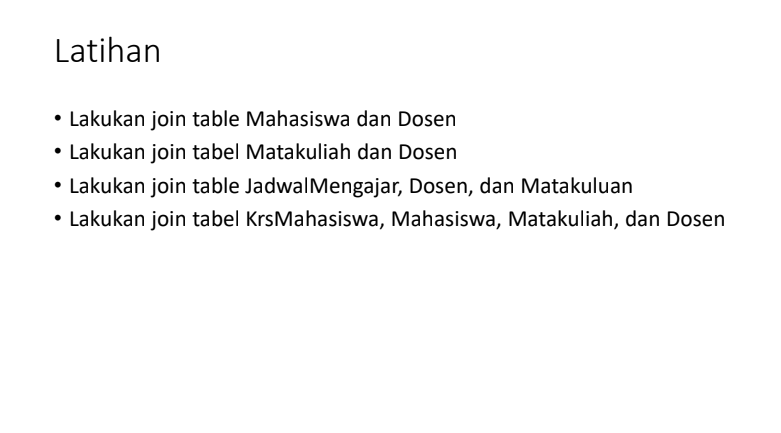

# PRAKTIKUM 5 - SQL JOIN 

- Sql Join adalah merupakan operasi yang digunakan untuk menggabungkan dua tabel atau lebih dengan hasil berupa gabungan dari kolom-kolom yang berasal dari tabel-tabel tersebut.

- Dalam SQL, Operasi Join memungkinkan Anda untuk mengambil data dari beberapa tabel yang memiliki hubungan yang saling terkait.

Beberapa jenis Join yang terdapat di SQL :

1. Natural Join 
-  jenis Join yang dilakukan berdasarkan kesamaan kolom dengan nama yang sama di kedua tabel yang ingin digabungkan.
2. Left Join
- Menampilkan semua data pada table A dan sebagian data pada table B yang bersinggungan dengan table A
3. Right Join
- Menampilkan semua data pada table B dan sebagian data pada table A yang bersinggungan dengan table B
4. Full Join
- Menampilkan semua data pada table A dan B

